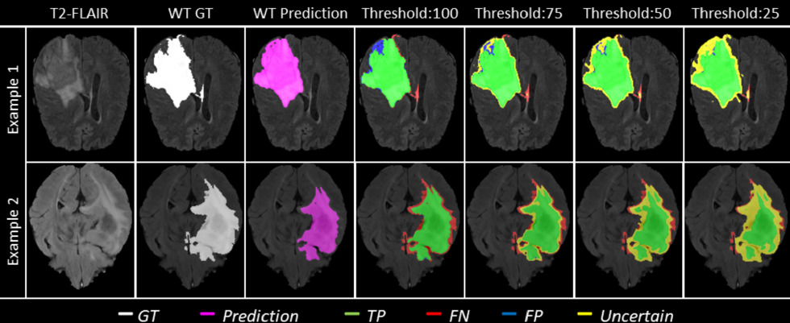
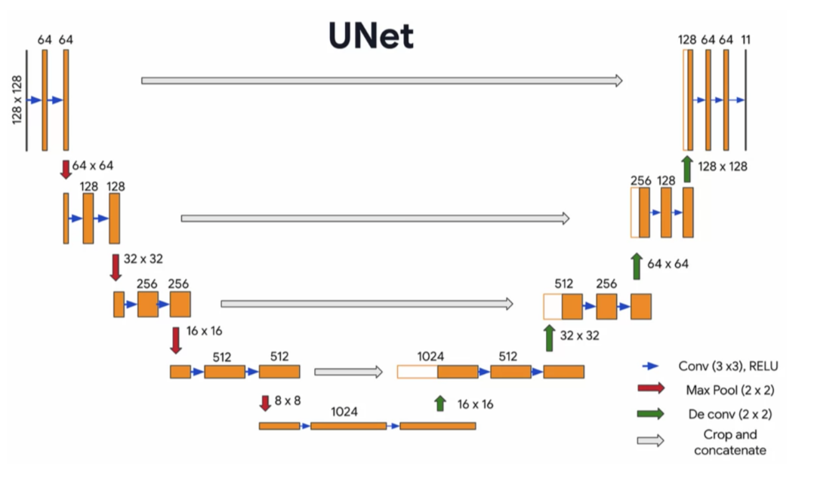
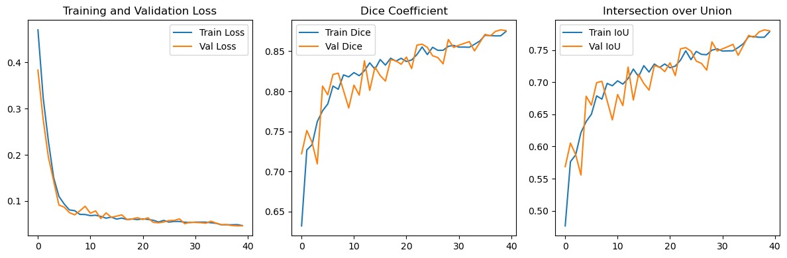
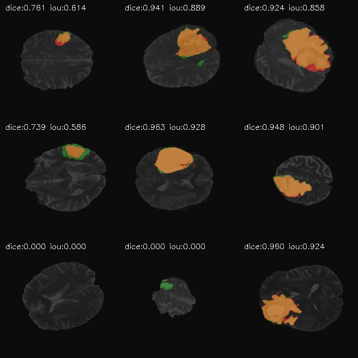
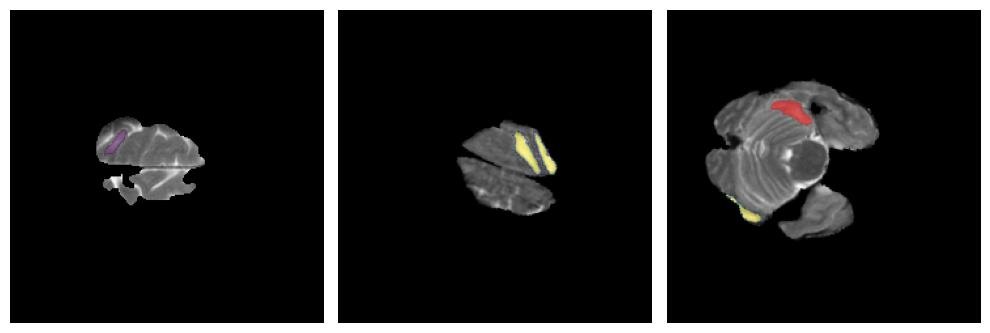

# Brain Tumor Semantic Segmentation with U-Net (PyTorch)
## Goal

The aim of this project is to apply deep learning techniques for the **semantic segmentation of brain tumors** in medical imaging using **Magnetic Resonance Imaging (MRI)** data from the [BraTS 2020 dataset](https://www.kaggle.com/datasets/awsaf49/brats2020-training-data).  

The pipeline includes:
- Implementing and training a **Convolutional Neural Network** (preferably U-Net) for segmentation.
- Applying appropriate **pre- and post-processing**.
- Evaluating the model with **segmentation-specific metrics**.
- Using **PyTorch** for deep learning, **OpenCV** for image processing, and **Matplotlib** (or similar) for visualization.

---

## General Description

The complete workflow follows these stages:

1. **Load and preprocess** the MRI dataset from Kaggle.  
   - Split into training, validation, and test sets.  
   - Resize and normalize images.  
   - Prepare binary segmentation masks.

2. **Design and implement** a semantic segmentation network  
   - Preferably U-Net or similar encoder-decoder architecture.

3. **Train the model**  
   - Use segmentation loss functions (Dice Loss, Binary Cross-Entropy).  
   - Include early stopping or learning rate scheduling.

4. **Validate the model** on unseen data and visualize predictions.

5. **Evaluate performance**  
   - Metrics: Dice coefficient and Intersection over Union (IoU).

6. **Provide qualitative results**  
   - Overlay predicted masks on original images with proper color coding.

---

## Dataset

The [BraTS 2020 Training Data](https://www.kaggle.com/datasets/awsaf49/brats2020-training-data) contains **pre-operative MRI scans** from multiple institutions with expert-annotated segmentation masks.  
Each case includes:
- **T1-weighted**
- **T1 with contrast enhancement (T1Gd)**
- **T2-weighted**
- **FLAIR**
- **Ground truth segmentation masks** for:
  - Enhancing tumor
  - Peritumoral edema
  - Necrotic core

For this project:
- Combine the three segmentation labels (edema = 2, enhancing tumor = 4, necrotic core = 1) into a **single binary mask**.

**Recommended split**:  
- 70% training  
- 15% validation  
- 15% testing  

| Brain Tumor Detection Image Examples |
|:-:|
|  |

---

## Model Architecture

The model will be based on **U-Net**, a popular encoder-decoder architecture for biomedical image segmentation.  
Skip connections between encoder and decoder layers enable accurate localization of tumor regions.

| U-Net Schematic |
|:-:|
|  |

---

## Evaluation Metrics

We will use **Dice Coefficient** and **IoU** to measure segmentation performance.

$$
\text{Dice} = \frac{2 \cdot |A \cap B|}{|A| + |B|}
$$

$$
\text{IoU} = \frac{|A \cap B|}{|A \cup B|}
$$

Where:
- **A** = predicted segmentation
- **B** = ground truth mask

---

## Requirements

- Python 3.8+
- [PyTorch](https://pytorch.org/)
- OpenCV
- Matplotlib
- NumPy
- Kaggle API (for dataset download)

Install dependencies:
```bash
pip install torch torchvision opencv-python matplotlib numpy kagglehub

```
##  Results

During model training, the following results were obtained:
- Loss: 0.05 in both the training and validation sets, indicating stable convergence with no signs of overfitting.
- Dice coefficient: 87% in training and validation, showing a high overlap between the model predictions and the actual masks.
- Intersection over Union (IoU): 77% in training and 78% in validation, confirming consistent and accurate segmentation in both sets.

| Performance metrics |
|:-:|
|  |

These results reflect a well-generalized model, capable of segmenting tumors with high accuracy and without significant loss of performance between training and validation data.

| Examples of predictions |
|:-:|
|  |

These are three specific cases in which the model failed to classify correctly:
- Cases 1 and 2: No prediction mask was generated.
- Case 3: The mask generated was incorrect and did not correspond to the actual tumor region.
Possible causes identified:
- The first two cases present scans with unusual shapes. The low representation of this type of geometry in the training set may have affected the model's ability to generalize them. A more balanced dataset, with a greater number of examples of these variations, could improve performance.
- Loss of information due to channel reduction: In the third case, the use of only one of the four layers available in the original dataset likely limited the contextual information, affecting tumor detection.
- Difficulty in detecting small tumors: It was observed that the smaller the tumor size, the more difficult it was for the model to identify it accurately. This was evident in both the first and third erroneous images.
In summary, the errors seem to be mainly linked to the diversity and quality of the dataset, as well as the loss of structural information during preprocessing.

| Error cases |
|:-:|
|  |


